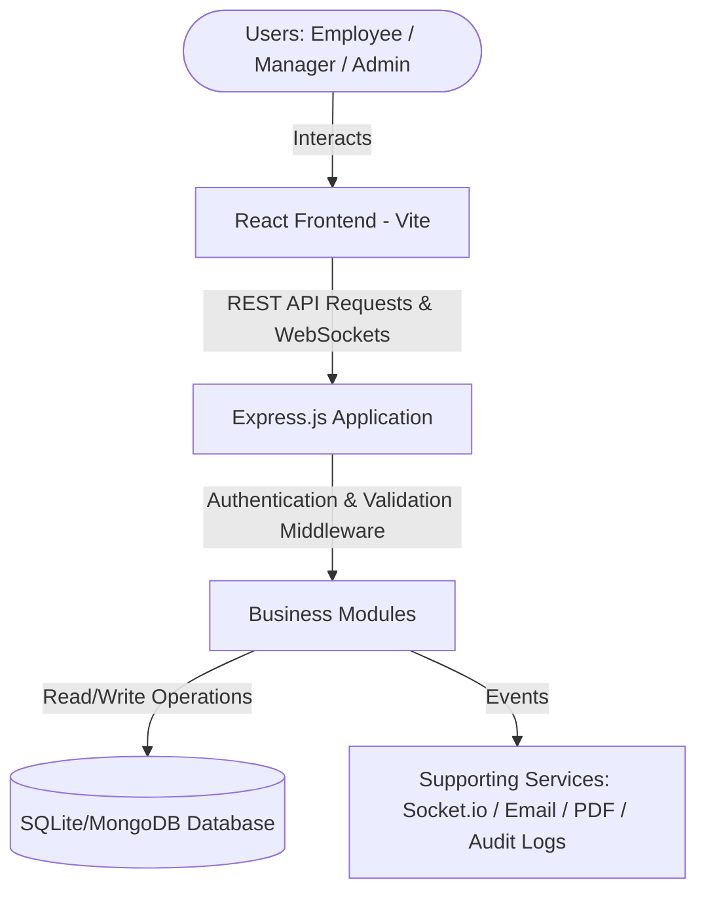
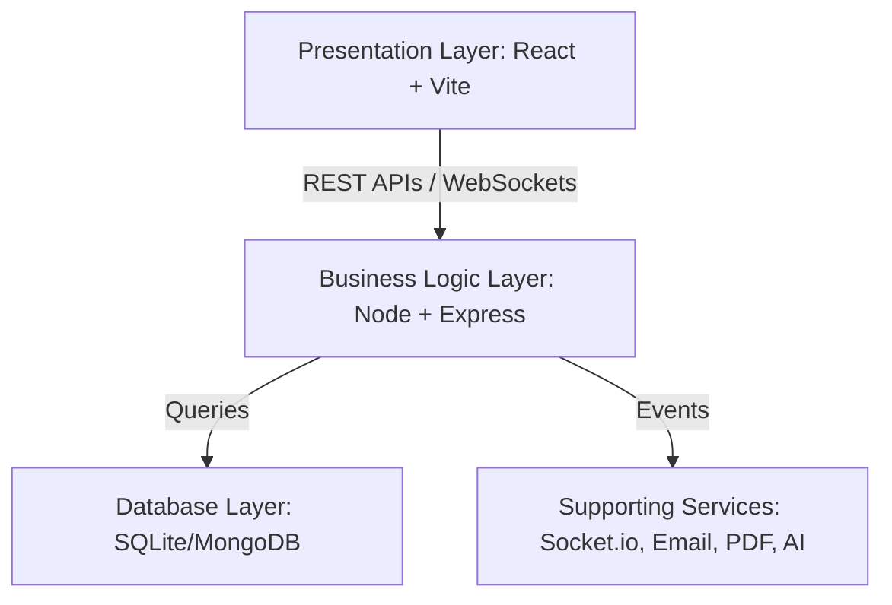
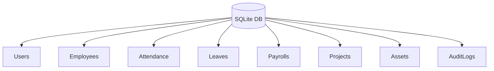

# SYNCRA ENTERPRISE: PROJECT REPORT

**Developed By:** Khushi Pathak & Simran Jeet Gill

---

## TABLE OF CONTENTS
1. [Chapter 1: Introduction](#chapter-1-introduction)
2. [Chapter 2: Literature Review](#chapter-2-literature-review)
3. [Chapter 3: System Analysis and Design](#chapter-3-system-analysis-and-design)
4. [Chapter 4: System Implementation](#chapter-4-system-implementation)
5. [Chapter 5: Database Design](#chapter-5-database-design)
6. [Chapter 6: API Documentation](#chapter-6-api-documentation)
7. [Chapter 7: System Testing](#chapter-7-system-testing)
8. [Chapter 8: Results and Discussion](#chapter-8-results-and-discussion)
9. [Chapter 9: Future Scope](#chapter-9-future-scope)
10. [Chapter 10: Conclusion](#chapter-10-conclusion)

---

## CHAPTER 1: INTRODUCTION

### 1.1 Project Overview
In today's rapidly evolving business environment, organizations require integrated digital solutions to efficiently manage workforce operations, optimize productivity, and support data-driven decision-making. Traditional Human Resource Management Systems (HRMS) often focus on isolated functionalities such as attendance or payroll, resulting in fragmented workflows and limited operational visibility.

**Syncra Enterprise** is an AI-powered Enterprise Workforce Management Platform designed to centralize and automate critical organizational processes within a unified web-based application. The platform provides a comprehensive solution that enables organizations to manage employees, attendance, payroll, leave requests, recruitment, project assignments, performance evaluations, organizational hierarchy, office locations, asset management, notifications, reports, and analytics through a single interface.

The platform is built using a modern full-stack architecture consisting of **React.js, Node.js, Express.js, and SQLite/MongoDB**, ensuring scalability, maintainability, and high performance. It incorporates real-time communication using **Socket.IO**, interactive dashboards for organizational insights, and an AI-powered Operations Assistant (**Rachel**) to enhance decision-making and automate repetitive administrative tasks.

Unlike conventional workforce management systems, Syncra Enterprise follows a modular architecture where each business function is developed as an independent module. This approach improves maintainability, simplifies future enhancements, and allows organizations to adopt only the modules relevant to their operational requirements.

The platform supports multiple organizational roles with secure authentication and role-based access control, ensuring that employees, managers, HR personnel, and administrators can access only the resources and functionalities appropriate to their responsibilities. Additionally, enterprise-grade security practices are incorporated to protect sensitive organizational data.

By integrating workforce management, operational analytics, AI assistance, and real-time collaboration into a single platform, Syncra Enterprise enables organizations to streamline administrative processes, improve employee engagement, enhance managerial efficiency, and facilitate informed strategic decision-making.

### 1.2 Background
Modern enterprises manage large volumes of employee information, organizational data, financial records, attendance logs, recruitment activities, and performance metrics on a daily basis. As organizations grow, managing these operations through multiple disconnected software applications or manual processes becomes increasingly inefficient.

Most organizations utilize separate systems for attendance management, payroll processing, recruitment, employee records, and project management. The lack of integration among these systems leads to duplicated data, inconsistent records, delayed reporting, and increased administrative effort.

Advancements in cloud computing, web technologies, artificial intelligence, and real-time communication have created opportunities for developing unified enterprise management platforms capable of handling multiple organizational processes through a centralized interface.

Syncra Enterprise leverages these technologies to create an integrated platform that simplifies workforce management while providing organizations with intelligent insights, automation capabilities, and secure access to organizational resources.

### 1.3 Problem Statement
Organizations encounter several operational challenges due to fragmented workforce management systems and manual administrative processes. These challenges include:
* Decentralized employee information spread across multiple software systems.
* Manual attendance tracking leading to inaccuracies and delayed reporting.
* Complex leave approval workflows requiring extensive administrative effort.
* Payroll calculations prone to human error.
* Lack of centralized recruitment and candidate tracking.
* Difficulty monitoring employee performance across departments.
* Limited visibility into organizational productivity and workforce analytics.
* Absence of real-time communication between different organizational units.
* Difficulty managing organizational hierarchy, office locations, and company assets.
* Increasing administrative workload as organizational size grows.

These limitations reduce operational efficiency, increase processing time, and hinder effective decision-making.

### 1.4 Existing System
Traditional workforce management solutions generally focus on individual business functions rather than providing a unified organizational platform. Many organizations continue to rely on separate software applications for payroll, attendance, recruitment, and employee management.

#### Limitations of Existing Systems:
* Fragmented data across multiple applications.
* Repeated manual data entry.
* Limited automation.
* Poor integration between HR functions.
* Lack of AI-driven insights.
* Minimal real-time communication.
* Inadequate reporting capabilities.
* Difficult scalability for growing organizations.
* High operational and maintenance costs.
* Limited customization options.

These shortcomings highlight the need for an integrated enterprise management solution.

### 1.5 Proposed System
Syncra Enterprise proposes a centralized enterprise workforce management platform that integrates all major organizational functions into a single web application. The system automates routine administrative tasks, improves collaboration, and provides real-time visibility into organizational operations.

The proposed platform incorporates several independent modules, including employee management, attendance tracking, leave management, payroll processing, recruitment, project management, organizational hierarchy, notifications, reports, analytics, and AI-powered assistance. These modules communicate through a common backend and centralized database, ensuring consistency of information across the organization.

The modular architecture enables future scalability while reducing system complexity. Organizations can extend the platform by integrating additional business modules without affecting existing functionality.

### 1.6 Objectives

#### Primary Objectives:
* Develop a centralized workforce management platform.
* Automate HR and administrative workflows.
* Improve operational efficiency through process automation.
* Reduce manual data entry and paperwork.
* Provide secure authentication and authorization.
* Enable real-time communication across organizational units.
* Generate analytical reports for management.
* Support AI-assisted enterprise operations.

#### Secondary Objectives:
* Improve employee engagement.
* Simplify organizational hierarchy management.
* Enhance decision-making using analytics.
* Facilitate scalable enterprise growth.
* Ensure high system availability and maintainability.
* Support future AI-driven enhancements.

### 1.7 Scope of the Project
The scope of Syncra Enterprise encompasses comprehensive workforce and enterprise management functionalities. The platform includes:
* Employee Management
* Attendance Management
* Leave Management
* Payroll Management
* Recruitment Management
* Performance Evaluation
* Project Management
* Skills Management
* Organizational Structure
* Office Location Management
* Asset Management
* Notification System
* Real-time Communication
* Reports and Analytics
* AI Operations Assistant
* Role-Based Access Control
* Document Management
* Audit Logs
* Administrative Dashboard

The platform is intended for small, medium, and large organizations seeking a unified enterprise management solution.

### 1.8 Advantages of the Proposed System
* Centralized management of enterprise operations.
* Modular and scalable architecture.
* Improved data consistency and integrity.
* Automated HR workflows.
* Real-time notifications and communication.
* AI-assisted operational support.
* Interactive dashboards and analytics.
* Enhanced security through role-based access control.
* Reduced administrative workload.
* Improved decision-making through comprehensive reporting.

### 1.9 Applications
Syncra Enterprise can be deployed across various sectors, including:
* Corporate Organizations
* IT Companies
* Educational Institutions
* Healthcare Organizations
* Manufacturing Industries
* Government Departments
* Financial Institutions
* Startups
* Consulting Firms
* Non-Governmental Organizations (NGOs)

---

## CHAPTER 2: LITERATURE REVIEW

### 2.1 Introduction
Enterprise Workforce Management (EWM) systems have become essential for organizations aiming to improve operational efficiency, optimize workforce utilization, and streamline human resource processes. Over the past decade, advancements in cloud computing, artificial intelligence, big data analytics, and real-time communication technologies have transformed traditional Human Resource Management Systems (HRMS) into intelligent enterprise platforms capable of automating complex organizational workflows.

Modern organizations require integrated solutions that not only manage employee information but also support payroll processing, attendance monitoring, recruitment, project management, performance evaluation, collaboration, and strategic decision-making. Numerous commercial platforms have been developed to address these needs; however, each exhibits certain limitations in terms of customization, scalability, cost, or intelligent automation.

This chapter reviews existing enterprise workforce management systems, emerging technologies, and recent research relevant to the development of Syncra Enterprise.

### 2.2 Enterprise Workforce Management Systems
Enterprise Workforce Management Systems integrate multiple organizational operations into a centralized software platform. These systems simplify administrative activities while improving productivity, collaboration, and transparency across departments.

The primary objectives of Enterprise Workforce Management Systems include:
* Employee information management
* Attendance tracking
* Payroll automation
* Leave management
* Recruitment management
* Performance evaluation
* Workforce analytics
* Organizational communication
* Compliance management

Modern workforce management platforms typically provide web-based interfaces, cloud deployment, mobile accessibility, and real-time dashboards for organizational monitoring.

### 2.3 Human Resource Management Systems (HRMS)
Human Resource Management Systems focus primarily on managing employee-related information throughout the employee lifecycle. Typical HRMS functionalities include:
* Employee onboarding
* Attendance monitoring
* Payroll generation
* Leave approval
* Benefits administration
* Performance appraisal
* Employee records
* Document management

While HRMS platforms simplify HR operations, they often lack deeper integration with project management, analytics, AI-assisted decision-making, and enterprise-wide operational management.

### 2.4 Existing Enterprise Platforms

#### 2.4.1 Workday
Workday is a cloud-based enterprise platform providing HR, finance, payroll, and talent management solutions.
* **Advantages**: Cloud-native architecture, comprehensive HR features, strong analytics capabilities, and enterprise scalability.
* **Limitations**: High implementation cost, complex configuration, and limited customization for smaller organizations.

#### 2.4.2 SAP SuccessFactors
SAP SuccessFactors is one of the leading Human Capital Management (HCM) platforms used by multinational organizations.
* **Features**: Employee Central, Payroll, Learning Management, Recruitment, Performance Management, and Succession Planning.
* **Limitations**: Expensive licensing, steep learning curve, and complex deployment.

#### 2.4.3 Oracle HCM Cloud
Oracle HCM Cloud provides integrated human resource and talent management solutions.
* **Features**: HR Management, Workforce Planning, Payroll, Recruitment, AI Recommendations, and Workforce Analytics.
* **Limitations**: High infrastructure cost, requires specialized administration, and lengthy implementation process.

#### 2.4.4 BambooHR
BambooHR is designed primarily for small and medium-sized organizations.
* **Features**: Employee Database, Leave Management, Recruitment, and Reporting.
* **Limitations**: Limited enterprise functionality, basic analytics, and fewer customization options.

### 2.5 Artificial Intelligence in Workforce Management
Artificial Intelligence has significantly transformed enterprise management by enabling automation, intelligent recommendations, predictive analytics, and conversational assistants.
Major AI applications include:
* Resume screening
* Employee performance prediction
* Attrition analysis
* Payroll anomaly detection
* Chatbots & Conversational interfaces
* Intelligent report generation
* Workforce forecasting
* Automated notifications
* Decision support systems

The AI-powered Operations Assistant implemented in Syncra Enterprise aims to provide intelligent responses, automate repetitive workflows, and enhance managerial decision-making.

### 2.6 Real-Time Communication Technologies
Traditional enterprise systems rely heavily on periodic data synchronization, resulting in delayed information updates. Modern enterprise applications increasingly utilize technologies such as:
* WebSockets
* Socket.IO
* Event-driven architecture
* Push notifications
* Live dashboards

These technologies enable instant notifications, real-time attendance updates, live project monitoring, immediate leave approval notifications, and collaborative workspaces. Syncra Enterprise integrates Socket.IO to facilitate real-time communication across multiple organizational modules.

### 2.7 Cloud-Based Enterprise Applications
Cloud computing has become the preferred deployment model for enterprise software due to its scalability, flexibility, and cost efficiency. Cloud-based enterprise applications provide:
* Remote accessibility
* Automatic software updates
* High availability
* Scalability
* Reduced infrastructure costs
* Centralized data management

Syncra Enterprise is designed with cloud deployment compatibility, allowing organizations to scale resources based on operational requirements.

### 2.8 Modern Web Technologies
The rapid evolution of JavaScript frameworks has significantly improved enterprise web application development. The technology stack adopted in Syncra Enterprise includes:

#### Frontend:
* React.js
* Vite
* JavaScript (ES6+)
* HTML5 / CSS3

#### Backend:
* Node.js
* Express.js

#### Database:
* SQLite (local file-mode) / MongoDB (NoSQL)

#### Additional Technologies:
* Socket.IO
* REST APIs
* JWT Authentication
* AI Integration

These technologies collectively provide high performance, modularity, maintainability, and scalability.

### 2.9 Research Gap
Although existing enterprise management platforms provide comprehensive HR functionalities, several limitations remain. The major research gaps identified are:
* High licensing and maintenance costs.
* Limited AI-assisted automation.
* Complex deployment procedures.
* Poor customization flexibility.
* Fragmented module integration.
* Limited real-time collaboration.
* Inadequate intelligent analytics.
* Restricted modular scalability.

These limitations motivated the development of Syncra Enterprise.

### 2.10 Proposed Contribution
Syncra Enterprise addresses the identified research gaps by introducing an integrated enterprise platform featuring:
* Unified workforce management
* AI-powered Operations Assistant
* Modular backend architecture
* Real-time communication
* Interactive analytics dashboards
* Enterprise authentication
* Scalable REST API architecture
* Centralized organizational management
* Intelligent reporting
* Enhanced user experience

The proposed platform emphasizes flexibility, maintainability, and extensibility while reducing administrative complexity.

### 2.11 Comparative Analysis

| Feature | Traditional HRMS | Workday | SAP SuccessFactors | Oracle HCM | Syncra Enterprise |
| :--- | :---: | :---: | :---: | :---: | :---: |
| **Employee Management** | ✓ | ✓ | ✓ | ✓ | ✓ |
| **Attendance Tracking** | ✓ | ✓ | ✓ | ✓ | ✓ |
| **Payroll Automation** | ✓ | ✓ | ✓ | ✓ | ✓ |
| **Recruitment** | Limited | ✓ | ✓ | ✓ | ✓ |
| **Project Management** | ✗ | Limited | Limited | Limited | ✓ |
| **Asset Management** | ✗ | Limited | Limited | Limited | ✓ |
| **AI Assistant** | ✗ | Partial | Partial | ✓ | ✓ |
| **Real-Time Alerts** | Limited | ✓ | ✓ | ✓ | ✓ |
| **Analytics Dashboard** | Basic | Advanced | Advanced | Advanced | ✓ |
| **Modular Architecture** | ✗ | ✗ | ✗ | ✗ | ✓ |
| **Role-Based Access** | ✓ | ✓ | ✓ | ✓ | ✓ |
| **Customizable** | Limited | Limited | Limited | Limited | ✓ |
| **Open Architecture** | ✗ | ✗ | ✗ | ✗ | ✓ |

---

## CHAPTER 3: SYSTEM ANALYSIS AND DESIGN

### 3.1 Introduction
System Analysis and Design defines the overall architecture, components, workflows, and interactions within the application. For an enterprise-level application like Syncra Enterprise, this phase focuses on creating a modular, scalable, and maintainable system capable of handling multiple organizational functions through a unified platform.

The architecture of Syncra Enterprise follows a **three-tier full-stack architecture**, consisting of a React-based frontend, a Node.js/Express backend, and a local/relational database. The backend is organized into independent business modules, allowing each enterprise function to operate as a self-contained service while sharing common infrastructure such as authentication, notifications, audit logging, scheduling, and real-time communication.

### 3.2 System Architecture
The overall architecture of Syncra Enterprise follows a clean decoupling of boundaries:



### 3.3 Architecture Overview
The application follows a **client-server architecture**.
* **The Frontend Layer** is responsible for user interaction and provides responsive dashboards, forms, analytics, and real-time updates.
* **The Backend Layer** exposes REST APIs that process requests, validate user permissions, execute business logic, and interact with the database.
* **The Database Layer** stores organizational data such as employee records, attendance logs, payroll information, recruitment details, documents, and analytics.

Supporting services such as Socket.IO, email notifications, audit logging, scheduling, and PDF generation enhance enterprise functionality without affecting the modular design.

### 3.4 Technology Stack

| Layer | Technology |
| :--- | :--- |
| **Frontend** | React.js |
| **Build Tool** | Vite |
| **Backend** | Node.js |
| **Framework** | Express.js |
| **Database** | SQLite (File-based) / MongoDB |
| **Authentication** | JWT (JSON Web Tokens) |
| **Real-Time Comms** | Socket.IO |
| **Charts & Analytics** | D3.js |
| **Animations** | Framer Motion |
| **Icons** | Lucide React |
| **Email Service** | Nodemailer |
| **PDF Generation** | PDFKit |
| **Scheduling** | Node Scheduler |
| **Version Control** | Git & GitHub |

### 3.5 System Workflow
The workflow of Syncra Enterprise consists of the following stages:
1. User opens the application.
2. Login credentials are submitted.
3. Backend authenticates the user.
4. JWT token is generated.
5. Role-based permissions are verified.
6. Dashboard is loaded according to the user's role.
7. User performs organizational operations.
8. Backend validates requests.
9. Business modules process operations.
10. Database stores or retrieves data.
11. Notifications are generated if required.
12. Audit logs are maintained.
13. Response is returned to the frontend.

### 3.6 Functional Requirements

#### Authentication:
* User Registration
* Login / Logout
* Password Management
* Token-based Authentication

#### Employee Management:
* Employee Profile & Directory
* Department Assignment & Status
* Designation Management

#### Attendance:
* Daily Attendance Check-In / Check-Out
* Shift Hours Logging & Reports

#### Leave:
* Leave Application Submission
* Manager Review & Approvals

#### Payroll:
* Salary Records & Deductions
* Payslip Generation & Downloads

#### Recruitment:
* Candidate Registration & Pipeline Status
* Interview Scheduling

#### Projects:
* Project Creation & Member Assignment
* Kanban Task Boards

#### Performance:
* Employee Goals & Target setting
* Reviews & Feedback loops

#### Assets:
* Hardware Asset Registration
* Allocation & Return Tracking

#### Documents:
* Policy Uploads & Secure storage
* Versioning & PDF manual downloads

#### Analytics:
* Interactive Org Health dashboards
* Custom reports exports

#### AI Operations Assistant:
* Natural Language interface
* Automated directory queries & tab switching

#### Notifications:
* Real-time alerts
* Email updates

### 3.7 Non-Functional Requirements
* **Performance**: Fast API response, efficient database joins, and sub-second Socket updates.
* **Scalability**: Decoupled backend architecture ready for cloud containerization (Docker/Kubernetes).
* **Security**: Enforced JWT headers, password salting, role guards, and secure database parameters.
* **Reliability**: Centralized express error-handling middleware.
* **Maintainability**: Reusable React components and standard modular file structures.

### 3.8 Backend Architecture
The backend is organized using a **feature-based modular architecture**:

```
backend/
├── src/
│   ├── api/
│   ├── core/
│   │   ├── database/
│   │   ├── socket/
│   │   ├── scheduler/
│   │   ├── email/
│   │   ├── audit/
│   │   ├── middleware/
│   │   └── pdf/
│   └── modules/
│       ├── auth/
│       ├── employee/
│       ├── attendance/
│       ├── leave/
│       ├── payroll/
│       ├── project/
│       ├── organization/
│       └── AI/
```

This structure promotes loose coupling, making each business domain independent and easier to maintain.

### 3.9 Frontend Architecture
The frontend is developed using React.js and Vite, adopting a component-based architecture. It provides reusable UI components, responsive layouts, dynamic routing, dashboard interfaces, form handling, data visualization, and smooth animations.

---

## CHAPTER 4: SYSTEM IMPLEMENTATION

### 4.1 Introduction
Syncra Enterprise has been developed using a modular full-stack architecture that separates the frontend, backend, database, and supporting services. This ensures that different organizational functions operate seamlessly within a unified platform.

### 4.2 Overall Implementation Architecture
The implementation follows three primary layers:
1. **Presentation Layer**: React + Vite client.
2. **Business Logic Layer**: Node.js + Express backend modules.
3. **Database Layer**: SQLite relational tables or MongoDB collections.
4. **Supporting Services**: Socket.io, Nodemailer SMTP, PDFKit, and the AI gateway.



### 4.3 Frontend Implementation
The frontend is built using React's component-based design, dividing the layout into:
* **Shell Components**: Navigation bars, headers, and sidebar drawers.
* **Feature Views**: Directory grids, Kanban workspaces, and diagnostic terminals.
* **AI Floating Widget**: Floating drawer panel with voice hooks.

### 4.4 Backend Implementation
Instead of placing all routes inside a single controller, every module contains its own:
* Routes Definition (`routes.js`)
* Controller Logic (`controller.js`)
* Service layer & Data Models
* Input validation rules

Centralized middleware is registered globally for:
* JWT verification & role authorization.
* Schema validations.
* Express error handling & unified logging.
* Audit trail logging.

### 4.5 Authentication Module
Responsible for register, login, password updates, and token generation.
* **Workflow**: Login inputs are validated $\rightarrow$ Password hash matches database record $\rightarrow$ JWT token is signed with user role and expiration time $\rightarrow$ Client attaches this token to all future REST requests.

### 4.6 Employee Management Module
Manages employee registration, directory logs, profile fields, and department assignments.

### 4.7 Attendance Management Module
Records daily check-ins, check-outs, calculations of total worked hours, and monthly logs.

### 4.8 Leave Management Module
Automates leave requests, approvals, and employee balance tracking.
* **Workflow**: Employee submits form $\rightarrow$ Notification triggers for manager $\rightarrow$ Manager approves or rejects $\rightarrow$ Database updates status and subtracts leave balance.

### 4.9 Payroll Module
Manages salary indices, payroll batch runs, tax calculations, and instant payslip PDF downloads.

### 4.10 Recruitment Module
Coordinates candidate pipelines (Applied, Screening, Interview, Offered, Hired) via a drag-and-drop board.

### 4.11 Project Management Module
Allows manager accounts to establish workspaces, assign team members, and track progress using Kanban task boards.

### 4.12 Performance Management Module
Tracks KPI targets, evaluations, reviews, and historical appraisal scores.

### 4.13 Asset Management Module
Maintains the hardware asset registry (devices, serials, and current assignees).

### 4.14 Organization Module
Manages organizational structure, designating offices, departments, and holiday calendars.

### 4.15 Notification Module
Delivers real-time warnings (Socket.IO) and email updates (Nodemailer) for operational triggers.

### 4.16 Analytics Module
Uses interactive charts to render employee demographics, payroll expenses, and leave trends.

### 4.17 AI Operations Assistant
The assistant **Rachel** parses natural language, queries database records, and updates the frontend tabs.

### 4.18 Email Service
Automates sending welcome emails, password resets, leave decisions, and payroll warnings.

### 4.19 Audit Logging
Logs system events (User Login, Data edits, payroll batches) into the system logs for compliance.

---

## CHAPTER 5: DATABASE DESIGN

### 5.1 Introduction
The database stores and manages all organizational information required for enterprise operations. It uses a relational SQLite structure (with MongoDB configuration support).

### 5.2 Database Architecture
The database follows a centralized architecture where all modules interact with a common database.



### 5.3 Major Collections & Tables

| Table / Collection | Purpose |
| :--- | :--- |
| **`users`** | Stores core authentication credentials and roles. |
| **`employees`** | Stores employee profile metadata. |
| **`attendance`** | Logs daily check-in and check-out timestamps. |
| **`leaves`** | Records vacation requests and status logs. |
| **`payrolls`** | Stores salary components, net earnings, and dates. |
| **`projects`** | Project workspaces and owner assignments. |
| **`assets`** | Device names, serial numbers, and assignees. |
| **`audit_logs`** | Activity logs mapping users, actions, and timestamps. |

### 5.4 Users Collection Schema
* `_id` (PK): Unique identifier.
* `name`: Full Name.
* `email`: Email Address.
* `password`: Encrypted password hash.
* `role`: System role (Admin, Manager, Employee).
* `status`: Active / Inactive.

### 5.5 Employees Collection Schema
* `_id` (PK): Unique employee identifier.
* `user_id` (FK): Links to `users.id`.
* `department`: Assigned department.
* `position`: Job title.
* `joiningDate`: Date of employment.
* `salary`: Base salary.

### 5.6 Attendance Collection Schema
* `_id` (PK): Unique record ID.
* `employee_id` (FK): Links to `employees.id`.
* `date`: Log date.
* `checkIn`: Check-in timestamp.
* `checkOut`: Check-out timestamp.
* `workingHours`: Total hours calculated.

### 5.7 Leave Collection Schema
* `_id` (PK): Unique leave ID.
* `employee_id` (FK): Links to `employees.id`.
* `leaveType`: Casual, Sick, Earned.
* `startDate` / `endDate`: Leave dates.
* `reason`: Text explanation.
* `approvalStatus`: Pending, Approved, Rejected.

### 5.8 Payroll Collection Schema
* `_id` (PK): Unique payroll ID.
* `employee_id` (FK): Links to `employees.id`.
* `basicSalary`: Base pay.
* `allowances` / `deductions`: Financial adjustments.
* `netSalary`: Final calculated pay.
* `paymentDate`: Salary release date.

### 5.9 Projects Collection Schema
* `_id` (PK): Unique project workspace ID.
* `projectName`: Title.
* `description`: Overview.
* `ownerId` (FK): Links to `users.id` (manager).
* `startDate` / `endDate`: Project duration.
* `status`: Planning, Active, Completed.

### 5.10 Notification Collection Schema
* `_id` (PK): Unique ID.
* `userId` (FK): Recipient ID.
* `title` / `message`: Alert details.
* `status`: Read / Unread.

### 5.11 Audit Log Collection Schema
* `_id` (PK): Unique log ID.
* `userId` (FK): User context.
* `action`: Event name.
* `module`: Affected component.
* `timestamp`: Date and time.

---

## CHAPTER 6: API DOCUMENTATION

### 6.1 Introduction
Syncra Enterprise exposes RESTful APIs that allow authenticated clients to perform organizational operations. All payloads exchange data in JSON format.

### 6.2 API Architecture
```
[React Frontend] --> [HTTP Request] --> [Express Router] --> [Auth Middleware] --> [Controller] --> [Database] --> [JSON Response]
```

### 6.3 Authentication APIs

| Endpoint | Method | Description |
| :--- | :--- | :--- |
| `/api/auth/login` | `POST` | Authenticate user credentials and return JWT. |
| `/api/auth/register` | `POST` | Create a new user profile (Admin/Manager). |
| `/api/auth/logout` | `POST` | Invalidate current user session. |
| `/api/auth/verify` | `GET` | Validate client JWT token integrity. |

#### Example Login Payload:
* **Request (`POST /api/auth/login`)**:
  ```json
  {
    "email": "admin@company.com",
    "password": "hashed_password"
  }
  ```
* **Response (`200 OK`)**:
  ```json
  {
    "success": true,
    "token": "JWT_HEADER_VALUE",
    "user": {
      "id": 1,
      "name": "Simran Gill",
      "role": "Admin"
    }
  }
  ```

### 6.4 Employee APIs

| Endpoint | Method | Description |
| :--- | :--- | :--- |
| `/api/employees` | `GET` | Retrieve list of all employees (with User Join). |
| `/api/employees/:id` | `GET` | Fetch single employee profile detail. |
| `/api/employees` | `POST` | Add a new employee to the directory. |
| `/api/employees/:id` | `PUT` | Update employee profile fields. |
| `/api/employees/:id` | `DELETE` | Remove employee profile. |

### 6.5 Attendance APIs

| Endpoint | Method | Description |
| :--- | :--- | :--- |
| `/api/attendance/checkin` | `POST` | Log employee check-in timestamp. |
| `/api/attendance/checkout` | `POST` | Log employee check-out timestamp. |
| `/api/attendance` | `GET` | Retrieve attendance records. |

### 6.6 Leave APIs

| Endpoint | Method | Description |
| :--- | :--- | :--- |
| `/api/leave/apply` | `POST` | Submit leave request. |
| `/api/leave` | `GET` | Retrieve leave history list. |
| `/api/leave/approve/:id` | `PUT` | Approve leave application. |
| `/api/leave/reject/:id` | `PUT` | Reject leave application. |

### 6.7 Payroll APIs

| Endpoint | Method | Description |
| :--- | :--- | :--- |
| `/api/payroll` | `GET` | Retrieve payroll logs. |
| `/api/payroll/generate` | `POST` | Generate payroll batch run. |
| `/api/payroll/payslip/:id` | `GET` | Download salary slip PDF. |

### 6.8 Recruitment APIs

| Endpoint | Method | Description |
| :--- | :--- | :--- |
| `/api/recruitment` | `GET` | Fetch list of recruitment candidates. |
| `/api/recruitment` | `POST` | Register a new candidate. |
| `/api/recruitment/:id` | `PUT` | Update candidate pipeline status. |

### 6.9 Project APIs

| Endpoint | Method | Description |
| :--- | :--- | :--- |
| `/api/projects` | `GET` | Fetch project workspace registries. |
| `/api/projects` | `POST` | Create a new project workspace. |
| `/api/projects/:id` | `DELETE` | Remove project workspace. |

### 6.10 Performance APIs

| Endpoint | Method | Description |
| :--- | :--- | :--- |
| `/api/performance` | `GET` | Fetch evaluation targets. |
| `/api/performance` | `POST` | Create review logs. |

### 6.11 Asset APIs

| Endpoint | Method | Description |
| :--- | :--- | :--- |
| `/api/assets` | `GET` | Retrieve inventory list. |
| `/api/assets` | `POST` | Add asset. |

### 6.12 Common HTTP Status Codes
* `200`: Request Successful
* `201`: Resource Created
* `400`: Bad Request (Validation failure)
* `401`: Unauthorized (Invalid or missing JWT)
* `403`: Forbidden (Insufficient role privileges)
* `404`: Resource Not Found
* `500`: Internal Server Error

---

## CHAPTER 7: SYSTEM TESTING

### 7.1 Introduction
Software testing was carried out on both frontend and backend components to verify functionality, usability, security, and integration.

### 7.2 Objectives of Testing
* Verify all modules perform according to requirements.
* Identify and resolve database constraints and queries.
* Validate authentication tokens and path authorization locks.
* Ensure application performance remains stable under load.

### 7.3 Testing Methodology
```
[Unit Testing] ──> [Integration Testing] ──> [System Testing] ──> [User Acceptance Testing]
```

### 7.4 Unit Testing
Individual modules were isolated and tested:
* **Authentication**: Login credentials verification loops.
* **Employee**: Employee CRUD endpoints validations.
* **Attendance**: Logs check-in calculations.
* **Leave**: Submits leave requests and tracks status.
* **Payroll**: Validates salary calculations and PDF generators.

### 7.5 Integration Testing
Tested communications between interconnected modules:
* `Login` $\rightarrow$ `Dashboard` (Validates token persistence).
* `Employee` $\rightarrow$ `Attendance` / `Payroll` (Validates profile ID mapping).
* `Recruitment` $\rightarrow$ `Employee` (Validates hired candidate onboarding automation).

### 7.6 System Testing
Evaluated the platform as a complete integrated system:
* Verified full user workflows, including onboarding, check-ins, tasks management, payroll runs, and chatbot interactions.

### 7.7 User Acceptance Testing (UAT)
Conducted testing from the perspective of Employees, Managers, and System Admins. All user groups were able to perform operations successfully.

### 7.8 Functional Testing Results

| Feature Tested | Expected Result | Status |
| :--- | :--- | :---: |
| **Login** | User token authorized | Pass |
| **Onboarding Form** | Employee profile written to DB | Pass |
| **Check-In** | Sample check-in timestamp written | Pass |
| **Leave Apply** | Request written to DB with Pending state | Pass |
| **Payroll Batch Run** | Payslips generated for current month | Pass |
| **Project Creation** | Workspace established with Manager ID | Pass |

---

## CHAPTER 8: RESULTS AND DISCUSSION

### 8.1 Introduction
The implementation of Syncra Enterprise successfully automated multiple HR, project tracking, asset auditing, and AI conversational workflows.

### 8.2 Home Page (Landing Page)
The landing page serves as the entry portal. It introduces the platform with a premium interactive bubble canvas background, asynchronous typewriter titles, and diagnostic kernel consoles.

### 8.3 Login Page
Provides a secure portal panel where users authenticate. JWT codes are stored securely in local session scopes.

### 8.4 Dashboard
The central command console. It renders health indicators, active employee distributions, attrition analytics, and helpdesk task backlogs.

### 8.5 Employee Directory
Provides managers with directory tables showing departments, positions, contact details, and employment statuses.

### 8.6 Attendance Clock
Features single-click Check-In/Check-Out buttons with live worked hours logs.

### 8.7 Leave Module
Displays leave requests, allowing managers to approve or reject requests with immediate status updates.

### 8.8 Payroll Console
Renders salary sheets and lets accountants run monthly payroll batches and download PDF payslips.

### 8.9 Recruitment Board
A visual Kanban board where candidate states are updated in real time.

### 8.10 Project Workspaces
Renders active projects. Managers can establish new project workspaces and select official owners from directory dropdowns.

### 8.11 AI Operations Assistant
Renders the floating widget assistant **Rachel**. Features Speech API auto-submit inputs and text-cleansed audio readbacks.

---

## CHAPTER 9: FUTURE SCOPE

### 9.1 Introduction
The modular architecture of Syncra Enterprise makes it highly extensible, allowing for future technological integrations.

### 9.2 Future Scope Advancements:
* **Predictive Analytics**: Implementing machine learning algorithms to forecast employee attrition, attendance trends, and payroll expenditures.
* **Native Mobile Apps**: Developing React Native or Flutter applications for Android and iOS devices.
* **Multi-Tenant SaaS Architecture**: Restructuring the database schema to support multiple organizations in isolated workspaces.
* **IoT Hardware Integration**: Linking physical RFID readers and biometric check-in devices directly to the attendance REST API.
* **Blockchain Security**: Utilizing decentralized ledgers to build tamper-proof audit trails and immutable payroll logs.

---

## CHAPTER 10: CONCLUSION

The successful development of **Syncra Enterprise** demonstrates the power of integrating workforce management functions into a single, scalable, and secure application. By combining directory management, attendance tracking, payroll processing, recruitment pipelines, project Kanban boards, and the AI Operations Assistant (**Rachel**), the platform eliminates disconnected software silos.

The use of a decoupled Node/React architecture ensures high performance, while comprehensive testing has validated platform security, stability, and usability. Syncra Enterprise provides a strong foundation for contemporary, data-driven, and automated workforce management.
