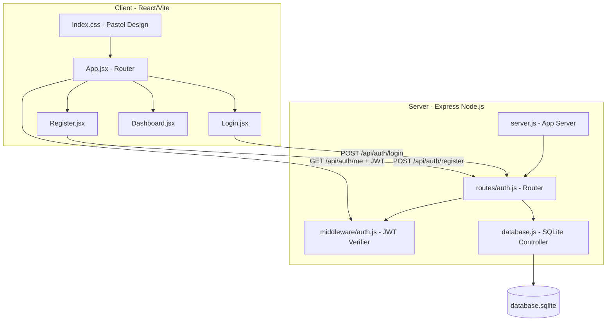
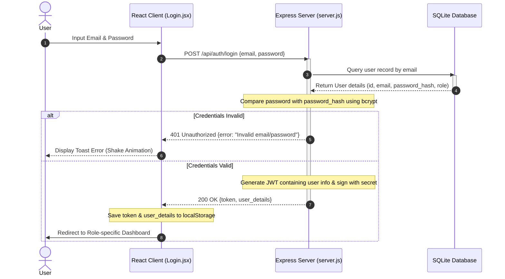

# Technical Architecture & Working Flow

This document details the frontend and backend architectural choices, working flows, and operational sequences of the Authentication module.

---

## 1. Architecture Overview

The system uses a decoupled Client-Server architecture:

### Frontend Stack Details:
* **Vite**: Lightweight dev compiler enabling instant hot-reloading (HMR).
* **React Hooks**: Managed states (`useState`, `useEffect`) capture user events, trigger fetch operations, and dynamically display alerts.
* **Vanilla CSS Style Tokens**: Avoids heavy utility classes to deliver a custom, glassmorphic pastel yellow and red card design.

### Backend Stack Details:
* **Express.js**: Exposes JSON REST endpoints with CORS support.
* **JSON Web Token (JWT)**: Used for stateless sessions, meaning the server does not store active session data in memory.
* **sqlite3**: Embeds database transactions inside the application engine, writing updates directly to `database.sqlite`.

---

## 2. Complete Working Flows

The authentication system runs three distinct logical flows:

### A. Account Registration Flow
1. The user inputs their Name, Email, Password, Organization, and selects their Role.
2. If **Admin** or **Super Admin** is selected, the client shows the **Access Code** text box.
3. The user clicks "Create Account", triggering a `POST` request to `/api/auth/register`.
4. The backend verifies that all fields exist and checks if the Email is already registered.
5. If the role is Admin or Super Admin, the backend matches the submitted code against security tokens (`ADMIN2026` or `SUPER2026`). If incorrect, it rejects the request with a `403 Forbidden` error.
6. The backend hashes the password using `bcryptjs` (salt factor 10) and inserts the user record into the SQLite database.
7. The server responds with `214 Created`, and the client redirects the user to the Login view.

### B. User Login Flow
1. The user inputs their Email and Password, triggering a `POST` request to `/api/auth/login`.
2. The backend queries the user by their email address. If not found, it responds with a generic `401 Unauthorized` (preventing user enumeration).
3. The backend compares the raw password with the hashed password stored in the database.
4. If valid, the backend compiles user details (`id`, `name`, `email`, `role`, `organization`) into a payload and signs it into a JWT using the secret key (`WFM_SECRET_KEY_2026`), set to expire in 24 hours.
5. The backend returns a `200 OK` JSON response containing the signed token and the user's basic profile details.
6. The React client saves the token as `wfm_token` and user profile as `wfm_user` in `localStorage`, updates React states, and mounts the Dashboard.

### C. Session Auto-Login Flow (On Mount)
1. On page load, `App.jsx` checks if `wfm_token` exists in `localStorage`.
2. If found, the client makes a `GET` request to `/api/auth/me`, appending the token in the `Authorization` header as `Bearer <token>`.
3. The backend's authentication middleware intercepts the request, extracts the token, and decrypts it using the secret key.
4. If decrypted successfully and not expired, the middleware appends the decoded payload to the request (`req.user`) and calls `next()`.
5. The API route returns `200 OK` with user details, and the React client automatically logs the user in and displays the Dashboard.
6. If the token is invalid or expired, the client clears the local storage and mounts the Login screen.

---

## 3. Sequence Diagram

This sequence diagram illustrates the step-by-step communication during the login validation flow:

